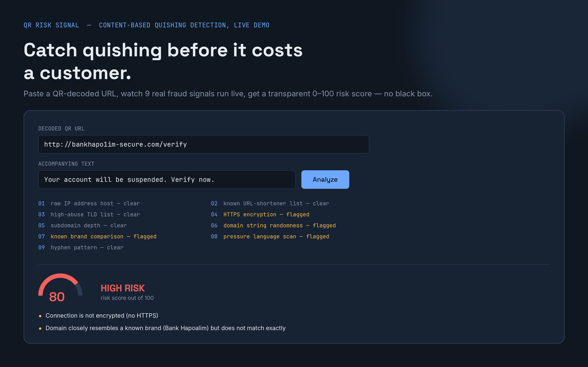

# QR Risk Signal — Live Demo

A content-based risk-scoring engine for detecting **quishing** (QR-code phishing) — built as a working prototype to demonstrate a fraud-detection signal that could plug into a bank, fintech, or payment platform's existing risk stack.

**[Try the live demo →](https://shehab6157-design.github.io/QR-risk-demo/index.html)**

## The problem

QR-code phishing has grown from 0.8% of all phishing attacks in 2021 to 12% in 2025 — roughly a 15x increase — yet 73% of people scan a QR code without ever checking where it actually leads. Existing defenses (phone camera preview banners, standalone checker apps) all depend on the user remembering to look. This demo takes a different approach: automatic, content-based scoring with no action required from the person scanning.

## How it works

Paste any URL (as if just decoded from a QR code), plus optional accompanying text (an SMS body, a sticker caption). The engine runs 9 content-based checks entirely in your browser — no data leaves the page:

- Raw IP address as the destination host
- Known URL-shortener detection
- Suspicious/disposable domain endings
- Missing HTTPS encryption
- Excessive subdomain depth
- Randomly-generated-looking domain names
- Typosquat similarity to known brands
- Urgency/pressure language in accompanying text
- Excessive hyphens (a common phishing-kit pattern)

Each triggered check adds to a 0–100 risk score, with a clear verdict (Likely Safe / Suspicious / High Risk) and the specific reasons behind it — fully transparent, not a black box.

## Current status

This is a working prototype: 100% accuracy on a 12-case hand-built test set covering realistic legitimate use (restaurant menus, parking payments, banking, ticketing) and realistic quishing patterns (typosquatted domains, IP-literal links, shortened URLs, disposable TLDs).

**What this is not (yet):** a production system. It runs on content alone — no live threat-intelligence feed, no transaction context. A real deployment would combine this signal with a bank or fintech's own transaction data (new payee, unusual amount, first-time scan location) for a complete picture.

## Interested in piloting this?

Reach out via [LinkedIn](https://www.linkedin.com/in/shehab-shibli-a383b5231) — looking for a bank or fintech design partner to validate this against real (anonymized) transaction patterns.
